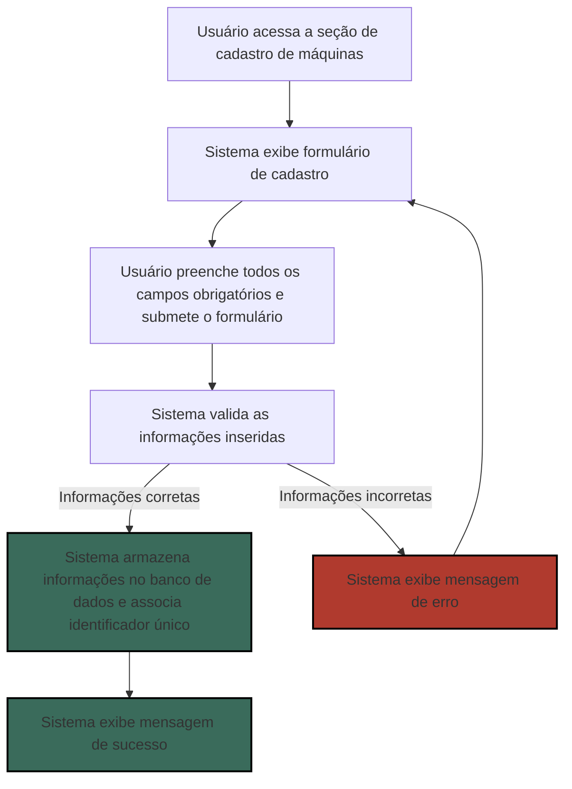
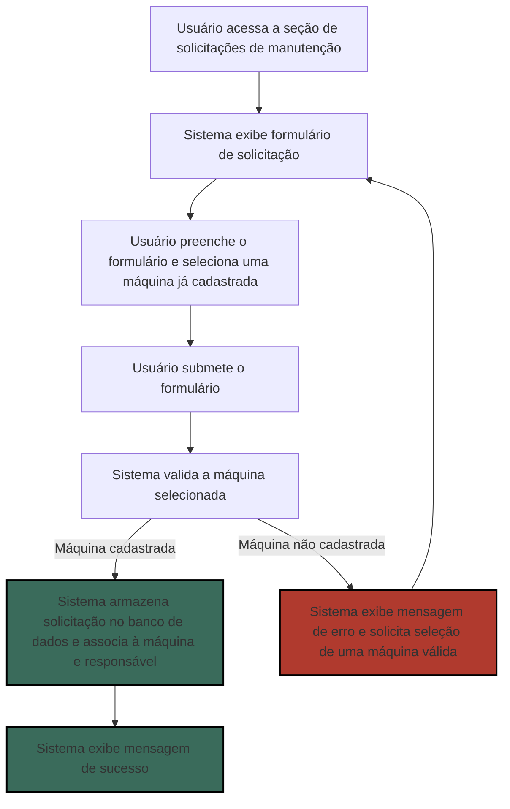
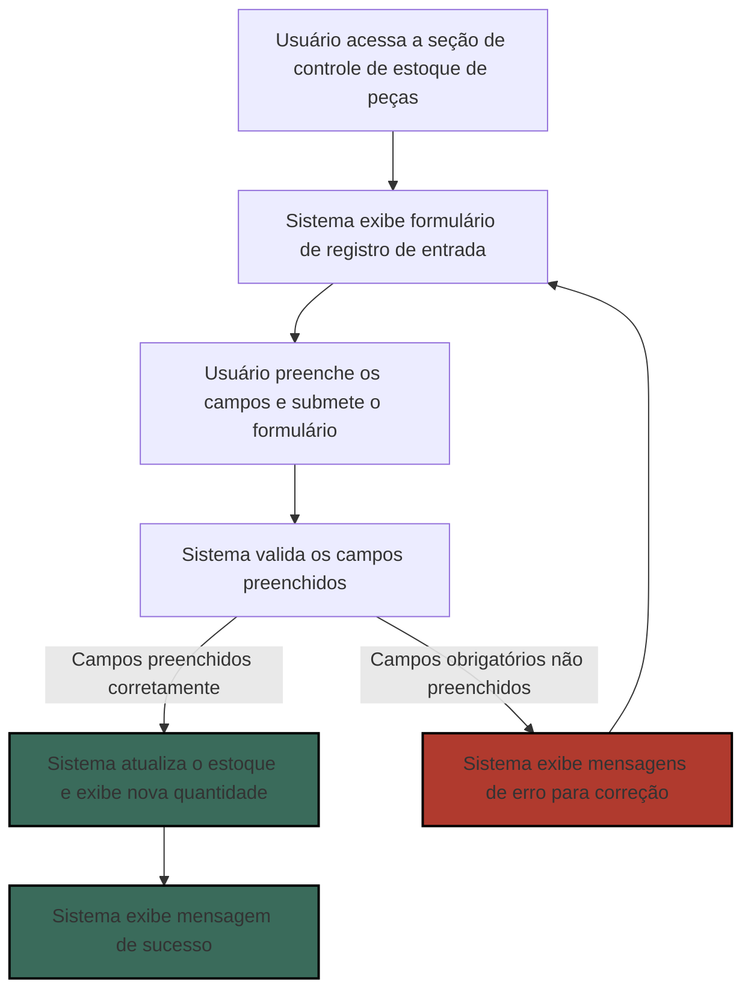
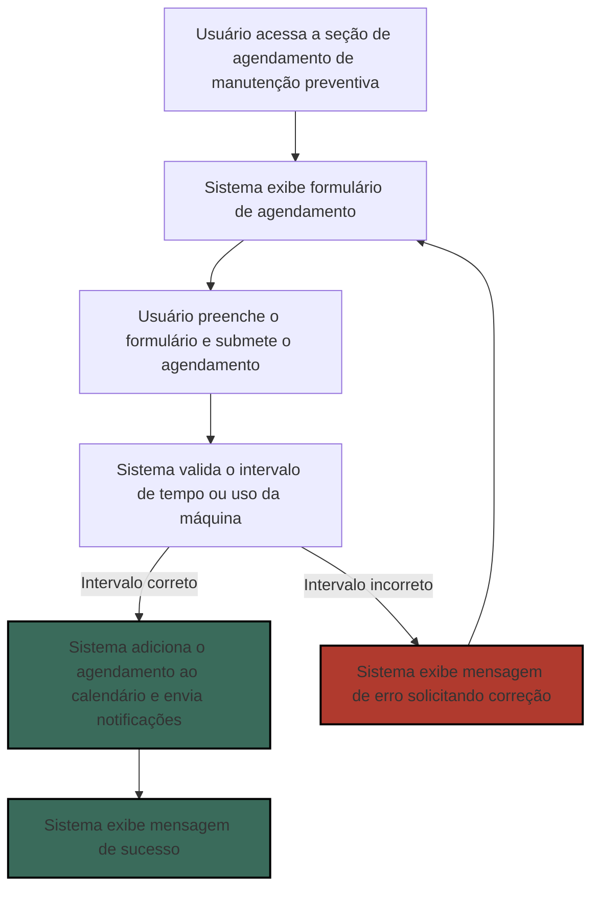
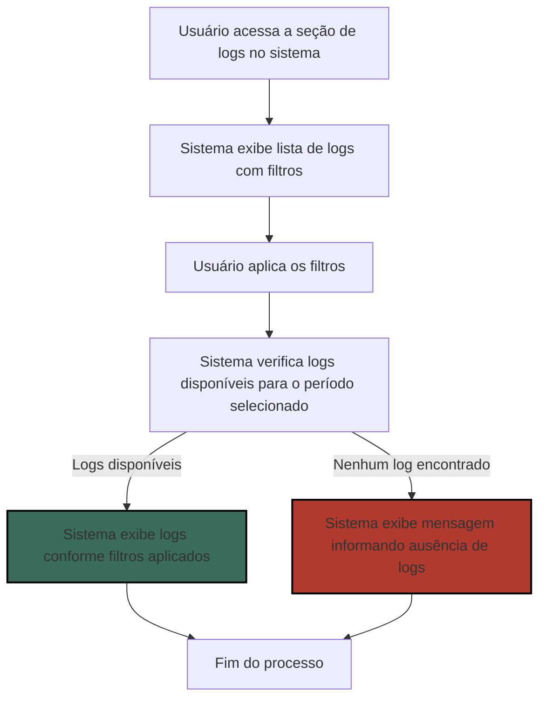
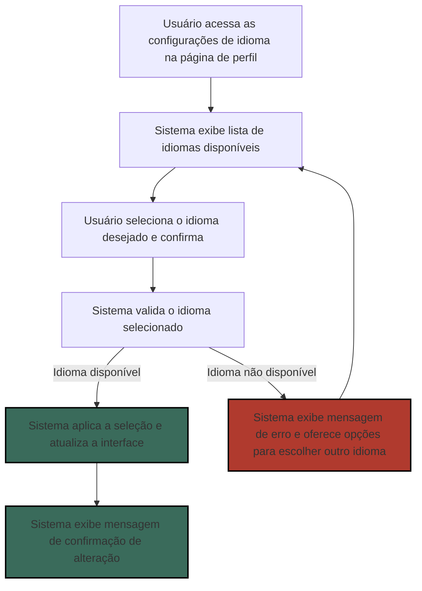
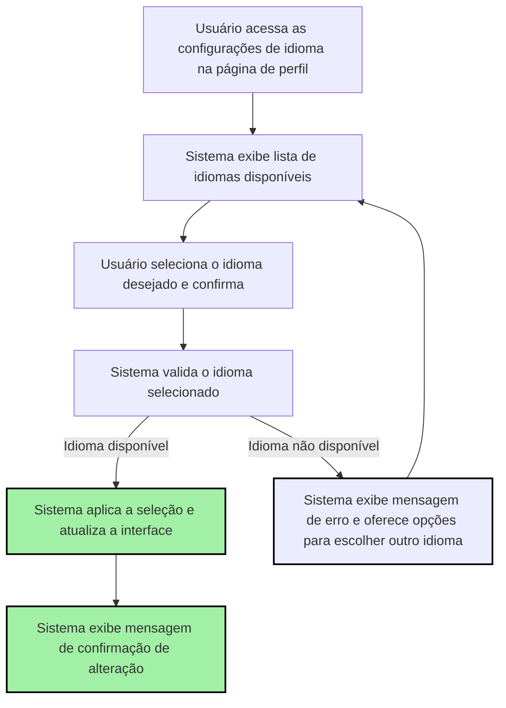

# PRD - Product Requirements Document (Template)

## Introdução & Objetivo

O sistema é uma aplicação web que visa melhorar o gerenciamento de manutenção e o controle de estoque de peças de reposição para o cliente. Com uma plataforma integrada, o sistema permite o cadastro e acompanhamento das máquinas e solicitações de manutenção, além de um controle preciso do estoque de peças. A solução centraliza todas as informações necessárias, eliminando a necessidade de sistemas múltiplos ou planilhas dispersas, e facilita o gerenciamento de maneira eficiente e intuitiva.
Este sistema se destaca pela sua capacidade de integrar funcionalidades de agendamento, monitoramento e documentação, com abordagem orientada para o usuário. A visão é oferecer uma solução completa que gere valor ao proporcionar eficiência e transparência no gerenciamento.

## Por que implementar isto?
A implementação do Sistema é justificada pela necessidade de melhorar a eficiência e a produtividade da empresa, automatizando os processos de manutenção que atualmente são realizados manualmente. Empresas que utilizam sistemas automatizados de gerenciamento de manutenção têm relatado melhorias significativas na organização e na redução de custos. 
Além disso, existe uma demanda crescente por soluções de gerenciamento de manutenção no mercado industrial, apresentando uma oportunidade estratégica. 

## Público alvo
Identificar os principais grupos de usuários ajudará a personalizar o desenvolvimento e melhorar a experiência geral.

| Perfil de usuário       	| Descrição, necessidades e interesses.                    	|
|------------------------------|---------------------------------------------------------------|
| Gerentes de Manutenção | Precisam de uma visão geral sobre as solicitações e manutenção das máquinas, através da visualização dos relatórios. |
| Supervisor de Manutenção| Verifica as necessidades de manutenção e gera as ordens de serviços alimentando o sistema. Também tem controle sobre o estoque de peças e ferramentas usados na manutenção|
| Técnicos de Manutenção| Necessitam registrar e acompanhar o status das solicitações e o controle de peças. |
|Assistentes de Almoxarifado| Usarão as funcionalidades de entrada e saída de peças e ferramentas de acordo com as ordens de serviços. |

## Personas

1. **Carlos, o Gerente de Manutenção**
   - **Descrição:** Carlos é o gerente de manutenção da empresa, responsável por supervisionar todas as operações de manutenção. Ele precisa de uma visão geral detalhada sobre as solicitações e o status das manutenções das máquinas.
   - **Objetivos:** Obter relatórios precisos e atualizados sobre o status das manutenções, garantir a eficiência dos processos de manutenção e tomar decisões estratégicas baseadas em dados.

2. **Fernanda, a Supervisora de Manutenção**
   - **Descrição:** Fernanda é responsável por verificar as necessidades de manutenção, gerar ordens de serviço e alimentar o sistema com as informações necessárias. Ela também tem controle sobre o estoque de peças e ferramentas usadas na manutenção.
   - **Objetivos:** Garantir que todas as necessidades de manutenção sejam corretamente registradas e atendidas, manter o controle eficiente do estoque e garantir que os recursos estejam disponíveis quando necessários.

3. **João, o Técnico de Manutenção**
   - **Descrição:** João é um técnico de manutenção que realiza a manutenção das máquinas e precisa registrar e acompanhar o status das solicitações e o controle das peças usadas.
   - **Objetivos:** Registrar o progresso das manutenções de forma precisa, ter acesso fácil às solicitações e garantir que as peças necessárias estejam disponíveis para realizar o trabalho de forma eficiente.

4. **Ana, a Assistente de Estoque**
   - **Descrição:** Ana é responsável pelo gerenciamento do estoque de peças e ferramentas, incluindo a entrada e saída de itens conforme as ordens de serviço.
   - **Objetivos:** Garantir que o estoque esteja sempre atualizado, processar rapidamente as entradas e saídas de peças e ferramentas e manter um registro preciso das quantidades em estoque.
---

Aqui estão os requisitos funcionais atualizados com os novos itens:

## Requisitos Funcionais

### Cadastro de Máquinas
1. O sistema deve permitir o cadastro de máquinas com informações detalhadas.
    1.1. O sistema deve fornecer um formulário de cadastro de máquinas com campos para nome, tipo, modelo, data de fabricação, número de série e localização.
    1.2. O sistema deve validar as informações inseridas no formulário, garantindo que todos os campos obrigatórios sejam preenchidos e que os dados estejam em um formato válido.
    1.3. Após o cadastro, as informações da máquina devem ser armazenadas em um banco de dados e associadas a um identificador único.

### Cadastro de Solicitações de Manutenção
2. O sistema deve permitir o cadastro de solicitações de manutenção com informações detalhadas.
    2.1. O sistema deve fornecer um formulário de cadastro de solicitações de manutenção com campos para descrição do problema, data da solicitação, prioridade, responsável e status da manutenção.
    2.2. O formulário deve permitir a seleção de uma máquina cadastrada para associar a solicitação de manutenção.
    2.3. Após o cadastro, a solicitação de manutenção deve ser armazenada em um banco de dados e associada à máquina selecionada e ao responsável pela manutenção.
    2.4. O sistema deve permitir a atualização do status da manutenção (pendente, em andamento, concluída, cancelada).

### Controle de Estoque de Peças
3. O sistema deve permitir o controle de estoque de peças de reposição.
    3.1. O sistema deve fornecer um formulário de cadastro de peças de reposição com campos para nome, código, fornecedor e quantidade em estoque.
    3.2. O sistema deve permitir o registro de entrada e saída de peças, com data e quantidade.
    3.3. O sistema deve atualizar automaticamente o estoque de peças com base nas entradas e saídas registradas.
    3.4. O sistema deve permitir a visualização do estoque de peças em tempo real, exibindo o nome, código, fornecedor e quantidade em estoque de cada peça.

### Agendamento de Manutenção Preventiva
4. O sistema deve permitir o agendamento de manutenções preventivas.
    4.1. O sistema deve permitir o agendamento de manutenções preventivas com base em intervalos de tempo ou uso da máquina.
    4.2. O sistema deve enviar notificações automáticas para lembrar os responsáveis sobre as manutenções preventivas agendadas.
    4.3. As manutenções preventivas agendadas devem ser registradas em um calendário integrado ao sistema, permitindo a visualização e o acompanhamento das manutenções.
    4.4. O sistema deve permitir a reprogramação ou cancelamento de manutenções preventivas, com registro das alterações feitas.

### Gerenciamento de Equipes
5. O sistema deve permitir o gerenciamento de equipes de manutenção.
    5.1. O sistema deve permitir o cadastro de equipes de manutenção, com informações sobre os colaboradores e suas especialidades.
    5.2. O sistema deve permitir a atribuição de equipes às solicitações de manutenção.
    5.3. O sistema deve permitir o gerenciamento da disponibilidade dos colaboradores.

### Autenticação e Autorização
6. O sistema deve implementar autenticação e autorização de usuários.
    6.1. O sistema deve permitir a criação de contas de usuário para diferentes tipos de acesso (administrador, técnico, etc.).
    6.2. O sistema deve controlar os acessos a diferentes funcionalidades da aplicação web, com base no tipo de usuário.
### Casos de uso
# Casos de Uso

## Cadastro de Máquinas

### Caso de Uso 1: Cadastro de Nova Máquina
**Descrição:** Um usuário com permissão de administrador deseja cadastrar uma nova máquina no sistema.

**Pré-condições:** O usuário deve estar autenticado no sistema e ter permissões de administrador.
**Fluxo Principal:**
1. O usuário acessa a seção de cadastro de máquinas.
2. O sistema exibe um formulário de cadastro com campos para nome, tipo, modelo, data de fabricação, número de série e localização.
3. O usuário preenche todos os campos obrigatórios e submete o formulário.
4. O sistema valida as informações inseridas. Se todas estiverem corretas, o sistema armazena as informações no banco de dados e associa um identificador único à máquina.
5. O sistema exibe uma mensagem de sucesso indicando que a máquina foi cadastrada com sucesso.
**Fluxo Alternativo:**
- Se o formulário estiver incompleto ou com informações inválidas, o sistema exibe mensagens de erro indicando os campos que precisam ser corrigidos.

---

## Cadastro de Solicitações de Manutenção

### Caso de Uso 2: Cadastro de Solicitação de Manutenção
**Descrição:** Um usuário deseja cadastrar uma nova solicitação de manutenção para uma máquina.

**Pré-condições:** O usuário deve estar autenticado no sistema e ter permissão para cadastrar solicitações de manutenção.
**Fluxo Principal:**
1. O usuário acessa a seção de solicitações de manutenção.
2. O sistema exibe um formulário com campos para descrição do problema, data da solicitação, prioridade, responsável e status da manutenção.
3. O usuário preenche o formulário e seleciona uma máquina já cadastrada.
4. O usuário submete o formulário.
5. O sistema armazena a solicitação de manutenção no banco de dados, associando-a à máquina selecionada e ao responsável pela manutenção.
6. O sistema exibe uma mensagem de sucesso indicando que a solicitação foi cadastrada.
**Fluxo Alternativo:**
- Se a máquina selecionada não estiver cadastrada, o sistema exibe uma mensagem de erro solicitando a seleção de uma máquina válida.

---
## Controle de Estoque de Peças

### Caso de Uso 3: Atualização do Estoque de Peças
**Descrição:** Um assistente de estoque deseja registrar a entrada de novas peças no estoque.

**Pré-condições:** O usuário deve estar autenticado no sistema e ter permissões para gerenciar o estoque.

**Fluxo Principal:**
1. O usuário acessa a seção de controle de estoque de peças.
2. O sistema exibe um formulário para registro de entrada de peças com campos para nome, código, fornecedor, quantidade e data.
3. O usuário preenche os campos e submete o formulário.
4. O sistema atualiza automaticamente o estoque com base nas entradas registradas e exibe a nova quantidade em estoque.
5. O sistema exibe uma mensagem de sucesso confirmando o registro da entrada.

**Fluxo Alternativo:**
- Se os campos obrigatórios não forem preenchidos corretamente, o sistema exibe mensagens de erro indicando quais campos precisam ser corrigidos.

---

## Agendamento de Manutenção Preventiva

### Caso de Uso 4: Agendamento de Manutenção Preventiva
**Descrição:** Um usuário deseja agendar uma manutenção preventiva para uma máquina.

**Pré-condições:** O usuário deve estar autenticado no sistema e ter permissões para agendar manutenções preventivas.

**Fluxo Principal:**
1. O usuário acessa a seção de agendamento de manutenção preventiva.
2. O sistema exibe um formulário com campos para a máquina, intervalo de tempo ou uso da máquina, e data do próximo agendamento.
3. O usuário preenche o formulário e submete o agendamento.
4. O sistema adiciona o agendamento ao calendário integrado e envia notificações automáticas para os responsáveis.
5. O sistema exibe uma mensagem de sucesso confirmando o agendamento.

**Fluxo Alternativo:**
- Se o intervalo de tempo ou uso da máquina estiver incorreto, o sistema exibe uma mensagem de erro solicitando a correção.

---

## Logging e Observabilidade

### Caso de Uso 5: Visualização de Logs
**Descrição:** Um administrador deseja visualizar os logs de eventos para identificar erros ou ações dos usuários.

**Pré-condições:** O usuário deve estar autenticado no sistema e ter permissões para acessar logs.

**Fluxo Principal:**
1. O usuário acessa a seção de logs no sistema.
2. O sistema exibe uma lista de logs registrados, com filtros para nível de logging (informação, aviso, erro).
3. O usuário aplica os filtros e visualiza os logs.
4. O sistema exibe os logs conforme os filtros aplicados.

**Fluxo Alternativo:**
- Se não houver logs disponíveis para o período selecionado, o sistema exibe uma mensagem informando que nenhum log foi encontrado.

---
## Internacionalização

### Caso de Uso 6: Seleção de Idioma
**Descrição:** Um usuário deseja selecionar um idioma para a interface do sistema.

**Pré-condições:** O usuário deve estar autenticado no sistema.

**Fluxo Principal:**
1. O usuário acessa as configurações de idioma na página de perfil.
2. O sistema exibe uma lista de idiomas disponíveis.
3. O usuário seleciona o idioma desejado e confirma.
4. O sistema aplica a seleção e atualiza a interface para o idioma escolhido.
5. O sistema exibe uma mensagem de confirmação de que o idioma foi alterado com sucesso.

**Fluxo Alternativo:**
- Se o idioma selecionado não estiver disponível, o sistema exibe uma mensagem de erro e oferece opções para escolher outro idioma.

---

## Documentação do Código

### Caso de Uso 7: Acesso à Documentação
**Descrição:** Um desenvolvedor deseja acessar a documentação do código para entender como usar uma API.

**Pré-condições:** O desenvolvedor deve ter acesso ao sistema e ao repositório de documentação.

**Fluxo Principal:**
1. O desenvolvedor acessa a seção de documentação no sistema.
2. O sistema exibe a documentação organizada por funções, classes e métodos.
3. O desenvolvedor navega até a seção da API desejada e visualiza exemplos de uso e descrições detalhadas.
4. O desenvolvedor usa as informações para implementar funcionalidades baseadas na API.

**Fluxo Alternativo:**
- Se a documentação estiver desatualizada, o desenvolvedor pode enviar uma solicitação para atualizações e receber um aviso de que o conteúdo está sendo revisado.

—

# Requisitos Não Funcionais

## Interface Amigável e Intuitiva
1.0 A interface deve ser fácil de usar e intuitiva para todos os usuários, independente do nível de conhecimento técnico. **(Crítico)**
1.1 Treinamentos e tutoriais integrados para novos usuários. **(Importante)**

## Responsividade
1.0 A aplicação web deve funcionar perfeitamente em diferentes dispositivos (computadores, tablets, smartphones). **(Crítico)**

## Segurança
1.0 Implementar medidas de segurança para proteger os dados da aplicação, evitando acessos não autorizados e protegendo a aplicação contra ataques de hackers. **(Crítico)**
1.1 Implementação de autenticação multifator (MFA) para acesso ao sistema. **(Importante)**
1.2 Monitoramento contínuo de segurança com alertas de atividades suspeitas. **(Importante)**

## Desempenho
1.0 A aplicação deve ser rápida e eficiente, respondendo às solicitações do usuário com rapidez, mesmo com um grande volume de dados. **(Crítico)**
1.1 Otimização de consultas ao banco de dados para garantir resposta rápida. **(Importante)**
1.2 Testes de carga regulares para garantir a escalabilidade do sistema. **(Importante)**

## Logging e Observabilidade
1.0 O sistema deve implementar logging e observabilidade para monitoramento contínuo e resolução de problemas. **(Importante)**
1.1 O sistema deve registrar eventos importantes, como erros, ações dos usuários e alterações nos dados, em um arquivo de log. **(Importante)**
1.2 O sistema deve permitir a configuração de diferentes níveis de logging (informação, aviso, erro) para personalizar o nível de detalhe dos logs. **(Bom ter)**
1.3 Os logs devem ser armazenados de forma segura e acessível para análise e resolução de problemas. **(Importante)**
1.4 O sistema deve integrar ferramentas de observabilidade para monitoramento contínuo de desempenho e disponibilidade. **(Bom ter)**

## Internacionalização
1.0 O sistema deve suportar múltiplos idiomas para atender a uma base de usuários diversificada. **(Importante)**
1.1 O sistema deve permitir a seleção de idioma pelo usuário no momento do login. **(Importante)**
1.2 O sistema deve fornecer traduções para todas as interfaces e mensagens de usuário nos idiomas suportados. **(Importante)**
1.3 O sistema deve permitir a adição de novos idiomas de forma modular, sem necessidade de grandes alterações no código. **(Bom ter)**

## Documentação do Código
1.0 O sistema deve manter uma documentação clara e detalhada do código e das APIs. **(Importante)**
1.1 A documentação do código deve incluir comentários claros e explicativos para todas as funções, classes e métodos. **(Importante)**
1.2 A documentação deve fornecer exemplos de uso para APIs e componentes principais do sistema. **(Importante)**
1.3 A documentação deve incluir guias de instalação, configuração e uso da aplicação para desenvolvedores e usuários finais. **(Importante)**
1.4 A documentação deve seguir um padrão consistente de formatação e organização, facilitando a leitura e a compreensão. **(Importante)**

### 📊 Métricas

| Medida            	| Esperado  | Resultados |
|-----------------------------|---------------------|------------|
| Internacionalização |	2 idiomas disponíveis	|	|
| Tempo de Autenticação de Usuários	|	1s	|	|
| Tempo de Carregamento das Páginas |	2s	|        	|

---

## Fora de escopo

<aside> 🚫 **Este projeto não incluirá o desenvolvimento de módulos para gestão financeira ou integração com sistemas de terceiros.**
Com a implementação do Sistema de Gestão de Manutenção (SGM), a empresa não apenas aprimorará suas operações internas, mas também abrirá oportunidades de monetização ao licenciar o software para outras empresas do setor, criando uma nova fonte de receita.
</aside>

## Dependências

<aside>
- **Banco de Dados**: Um sistema de gerenciamento de banco de dados (SGBD) para armazenar dados de manutenção, equipamentos, usuários, etc. Exemplos: PostgreSQL, MySQL, SQL Server.

- **Servidores de Aplicação**: Infraestrutura para hospedar o software e garantir sua disponibilidade. 
- **Frameworks e Bibliotecas**: Ferramentas e bibliotecas de desenvolvimento para construir o software. 
- **Sistema de Autenticação e Autorização**: Para gerenciar o acesso dos usuários e suas permissões.
- **Sistema de Monitoramento e Logs**: Para monitorar o desempenho do sistema e registrar eventos. 
- **Documentação e Suporte**: Recursos para criar e manter a documentação do software e fornecer suporte aos usuários.
- **Ambientes de Desenvolvimento e Teste**: Infraestrutura para desenvolvimento e testes do software.
- **Licenciamento e Compliance**: Dependências relacionadas ao licenciamento de software e conformidade com regulamentos e normas.
</aside>

### Plano de Lançamento

1. **Regras para Lançamento Interno:**
	- Validação do sistema em ambiente de teste
	- Divulgação para equipe interna e treinamento
	- Testes de aceitação pelo usuário (UAT)
	- Correção de bugs e refinamentos finais
	- Documentação completa para suporte interno

2. **Preparação Técnica:**
	- Configuração e otimização do ambiente de produção
	- Implementação de medidas de segurança
	- Backup e recuperação de dados configurados
	- Monitoramento de desempenho e logging ativado
	- Testes de carga e estresse no ambiente de produção

3. **Marketing e Comunicação:**
	- Desenvolvimento de material de marketing (brochuras, vídeos, etc.)
	- Plano de comunicação interna e externa
	- Criação de comunicados de imprensa e newsletters
	- Atualização do website e presença em mídias sociais
	- Planejamento de eventos de lançamento ou webinars

4. **Suporte ao Cliente:**
	- Treinamento da equipe de suporte ao cliente
	- Criação de FAQs e base de conhecimento
	- Estabelecimento de canais de suporte (telefone, e-mail, chat)
	- Planejamento de um sistema de tickets para suporte técnico
	- Avaliação e preparação de SLAs (Service Level Agreements)

5. **Treinamento e Educação:**
	- Criação de tutoriais e vídeos de treinamento
	- Workshops e sessões de treinamento para clientes
	- Documentação e guias do usuário
	- Disponibilização de recursos de treinamento online

6. **Feedback e Melhoria Contínua:**
	- Coleta de feedback de usuários beta
	- Implementação de um sistema de feedback contínuo
	- Análise de métricas de uso e desempenho
	- Planejamento de atualizações e melhorias futuras

7. **Aspectos Legais e Compliance:**
	- Revisão de conformidade com regulamentos locais e internacionais
	- Atualização de políticas de privacidade e termos de serviço
	- Garantia de acessibilidade e conformidade com normas de acessibilidade

8. **Finanças e Precificação:**
	- Definição de estratégia de precificação
	- Planejamento de faturamento e pagamentos
	- Configuração de sistemas de faturamento e contabilidade
	- Análise de retorno sobre investimento (ROI)

9. **Monitoramento Pós-Lançamento:**
	- Monitoramento contínuo de desempenho e segurança
	- Suporte ao cliente e resolução de problemas pós-lançamento
	- Coleta de feedback e implementação de melhorias
	- Relatórios periódicos de desempenho e uso

Este plano de lançamento garante uma preparação abrangente e organizada para o lançamento bem-sucedido do produto no mercado.

